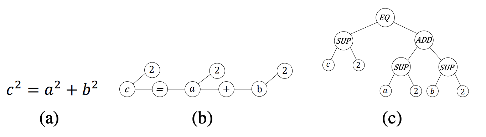
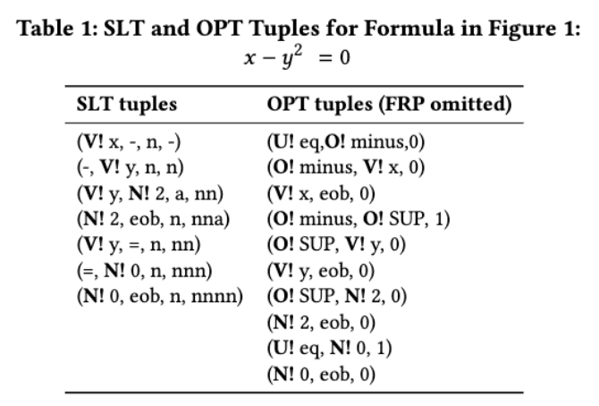

# About this repository
This repository is a fork of the official [Tangent-CFT](https://github.com/BehroozMansouri/TangentCFT) repository, 
with modifications for integration with the Mathematicon corpus. For detailed information about TangentCFT, 
refer to the original [paper](https://dl.acm.org/doi/abs/10.1145/3341981.3344235). Below is a brief summary:

## TangentCFT
Mathematical formulas can be represented as two distinct tree structures: Symbol Layout Tree (SLT) and Operational Tree (OPT). 

- **SLT (Symbol Layout Tree):** Encodes the spatial orientation of mathematical symbols.
- **OPT (Operational Tree):** Represents the semantics of the formula by showing the operators and their operands.

TangentCFT trains a FastText model on tuples derived from these trees. Each tuple consists of four elements: 
parent node, child node, the edge between them, and the path from the root node.


Each formula is represented as a list of these tuples. When training FastText, each formula is treated as a "sentence", 
each tuple as a "word", and each tuple element as a "character". Tuple elements can be tokenized in several ways, 
configurable by parameters:

- **embedding_type:** Node type + value as a single character or separately (examples of types: V! for variable, N! for number).
- **tokenize_number:** Encode each digit of a number or the number as a whole.
- **tokenize_all:** Encode entire terms as single characters or each letter separately.
- **ignore_full_relative_path:** Include or exclude the last tuple element.

## Folders and modules
```bash
├── TangentCFT
│   ├── Embeddings  # Pre-computed embeddings
│   ├── EncodedDataset  # Encoded datasets
│   ├── Models  # Pre-trained model parameters
│   │   ├── FastText  # FastText vocab and weights
│   │   └── Vocabulary  # Vocabulary mapping
│   ├── Retrieval_Results  
│   ├── TestQueries  # NTCIR-12 test queries
│   ├── config  # FastText configuration files
│   │   ├── config_1  # For SLT embeddings
│   │   ├── config_2  # For OPT embeddings
│   │   └── config_3  # For SLT type embeddings
│   └── tangent_cft  
│       ├── __init__.py
│       ├── Embedding_Preprocessing  # Tuple encoding implementation
│       ├── TangentS  # Package to parse formulas and construct trees
│       ├── configuration.py 
│       ├── logging_config.py
│       ├── tangent_cft_front_end.py  # CLI
│       ├── tangent_cft_back_end.py # Main logic
│       ├── tangent_cft_module.py
│       ├── tangent_cft_model.py
│       ├── tangent_cft_encoder.py  # Interface for tree tuple encoding
│       ├── tangent_cft_parser.py  # Parse math formulas from MathML and LaTeX
│       └── wiki_data_reader.py  # Read NTCIR-12 data
├── requirements.txt
└── README.md
```

# How to use 
To use TangentCFT embeddings, you need to pre-train on a large dataset. Originally it was trained on [NTCIR-12
dataset](https://www.cs.rit.edu/~rlaz/NTCIR-12_MathIR_Wikipedia_Corpus.zip), so the repository contains all necessary 
functions to load and parse this dataset. You can use another dataset, but preprocessing needs to be overridden.
For training, define a FastText config like [this](/config/config_1) one and place it in the [config](/config) directory.

## Using cli
To train using SLT representation you can use the following command:
```shell
python3 -m tangent_cft.tangent_cft_front_end.py -cid 1 -vocab "./Models/Vocabulary/slt_encoder.tsv" -mp "./Models/FastText/slt_model.model" --slt --t --etd "./EncodedDataset/slt_encoded_train.json --td "Your/Path/to/NTCIR-12_MathIR_Wikipedia_Corpus/MathTagArticles"
```
Where:

**-cid:** ID of the FastText configuration file from the [config](/config) folder</br>
**-vocab:** File to store the vocabulary map for the model</br>
**-mp:** Path to the FastText model</br>
**--slt:** Use SLT representation</br>
**--t:** Train the model</br>
**--etd:** Path to store the encoded training dataset</br>
**--td:** Path to the training dataset (/NTCIR-12_MathIR_Wikipedia_Corpus/MathTagArticles)</br>


For retrieval, add these parameters:
```shell
 --r --rf "slt_ret.tsv" --ri 1 --rf "slt_ret.tsv" --qd "./TestQueries"
```
Where:

**--r:** Perform retrieval</br>
**--ri:** Run ID for the retrieval file</br>
**--rf:** Retrieval result file name</br>
**--qd:** Directory with queries</br>

Similarly, for OPT representations:
```shell
python3 -m tangent_cft.tangent_cft_front_end.py -cid 2 -vocab "./Models/Vocabulary/opt_encoder.tsv" -mp "./Models/FastText/opt_model.model" --no-slt --etd "./EncodedDataset/opt_encoded_train.json" --r --rf "opt_ret.tsv" --ri 2 --td "Your/Path/to/NTCIR-12_MathIR_Wikipedia_Corpus/MathTagArticles"
```

And for SLT type representations:
```shell
python3 -m tangent_cft.tangent_cft_front_end.py -cid 3 -vocab "./Models/Vocabulary/slt_type_encoder.tsv" -mp "./Models/FastText/slt_type_model.model" --et 2 --slt --no-t --etd "./EncodedDataset/slt_type_encoded_train.json" --r --rf "slt_type_ret.tsv" --ri 3 --td "Your/Path/to/NTCIR-12_MathIR_Wikipedia_Corpus/MathTagArticles"
```
## In code
To train your model programmatically, use the following classes:

**- tangent_cft_parser.TangentCFTParser:** Parse formulas and get tree tuples.</br>
**- tangent_cft_encoder.FormulaTreeEncoder:** Tokenize and encode tree tuples.</br>
**- tangent_cft_module.TangentCFTModule:** Work with the FastText model and embeddings.</br>
**- tangent_cft_backend.TangentCFTBackEnd:** Train TangentCFT and perform retrieval.</br>

Example code to parse a formula:
```python
from tangent_cft.tangent_cft_parser import TangentCFTParser

encoded_formula = TangentCFTParser.parse(formula='x^2', mathml=False, slt=True)
```

Initialize your encoder:
```python
from tangent_cft.tangent_cft_encoder import FormulaTreeEncoder
from tangent_cft.Embedding_Preprocessing.encoder_tuple_level import TupleTokenizationMode

encoder = FormulaTreeEncoder(
            embedding_type=TupleTokenizationMode.Both_Separated,
            ignore_full_relative_path=True,
            tokenize_all=False,
            tokenize_number=True
        )
```

Define the module:
```python
from tangent_cft.tangent_cft_module import TangentCFTModule

module = TangentCFTModule(ft_model_path='path_to_fasttext_model')
```

Initialize TangentCFTBackEnd and train the model:
```python
from tangent_cft.tangent_cft_back_end import TangentCFTBackEnd
from tangent_cft.configuration import Configuration

ft_config = Configuration(config_file_path)
system = TangentCFTBackEnd(tangent_cft_module=module, encoder=encoder)
system.train_model(ft_config, train_data, encoded=True)
system.save_model(ft_model_path='ft_model_filepath', vocabulary_map_path='vocab_filepath')
```

Load a pre-trained model:
```python
tangent_cft = TangentCFTBackEnd.load(encoder_map_path='vocab_filepath',
                                     ft_model_path='ft_model_filepath')
```

## Checking the retrieval results. 
After the model is trained and the retrieval is done, the results are saved the directory "Retrieval_Results". 
In each line of the result file, there is the query id followed by relevant formula id, its rank, the similarity 
score and run id. TangentCFT results on NTCIR-12 dataset is Retrieval_Results directory as the sample. 
To evaluate the results, the judge file of NTCIR-12 task, is located in the Evaluation directory 
with [Trec_eval tool](https://trec.nist.gov/trec_eval/). This file is **different** from the original NTCIR-12 judge file. 
There are some formula ids with special characters that in our model we have changed (normlized) 
their name, therefore, we normalized their name in judge file as well.


# References
Please cite Tangent-CFT: An Embedding Model for Mathematical Formulas paper. (Mansouri, B., Rohatgi, S., Oard, D. W., Wu, J., Giles, C. L., & Zanibbi, R. (2019, September). Tangent-CFT: An Embedding Model for Mathematical Formulas. In Proceedings of the 2019 ACM SIGIR International Conference on Theory of Information Retrieval (pp. 11-18). ACM.)
